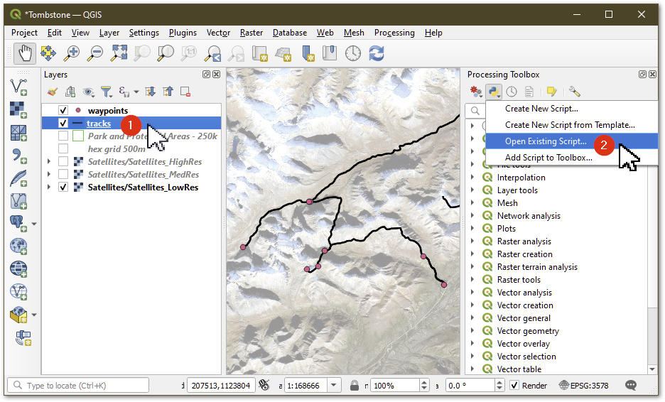
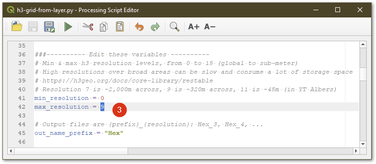
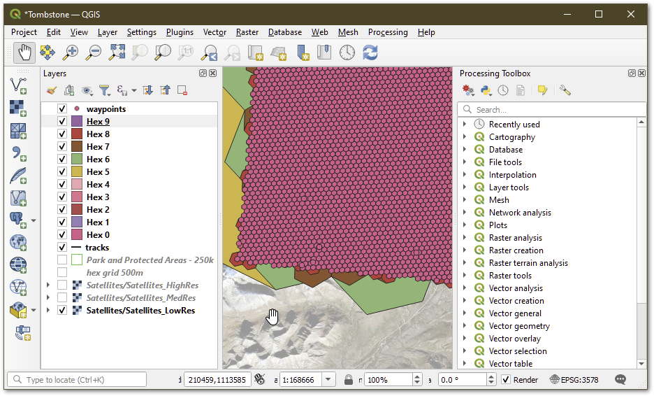

# Qgis & H3
*Using Uber's [H3 hex grid system][1] in Qgis*

https://github.com/maphew/code/tree/master/gis/qgis:

* h3-grid-from-layer.py - the script
* h3-in-qgis.md - this doc

## Usage

From Qgis:

1. Select a template layer in table of contents to get extent from
   1. Optionally select specific features
2. *Processing tool box >> Open existing script: [h3-grid-from-layer.py][0]* 
3. OR: *Plugins >> Python console >> Open editor >> load script: [h3-grid-from-layer.py][0]* 
4. Edit variables (particularly min/max resolution levels)
5. Run







## Preparation

If using Qgis via standard installer open **OSGeo4W shell** as administrator and install H3 with pip:

```
pip install H3
```

**OR** if you use **conda** create and install Qgis with H3:

    conda create -n qgis
    conda activate qgis
    conda install qgis
    conda install h3-py
    
    qgis

### More info: 

 - https://gis.stackexchange.com/questions/119495/does-qgis-work-with-anaconda


## Troubleshooting

Unsolved: how to get Qgis to add user profile to python search path?

Work around: Run OSGeo4W Shell as administrator before running pip. (You might have to uninstall the user space package.)

```
$ pip install h3
Defaulting to user installation because normal site-packages is not writeable
Requirement already satisfied: h3 in c:\users\matt\appdata\roaming\python\python39\site-packages (3.7.3)
```

Related: https://gis.stackexchange.com/questions/395708/missing-optional-dependency-tables-in-qgis

[1]: https://h3geo.org/
[0]: https://github.com/maphew/code/blob/master/gis/qgis/h3-grid-from-layer.py